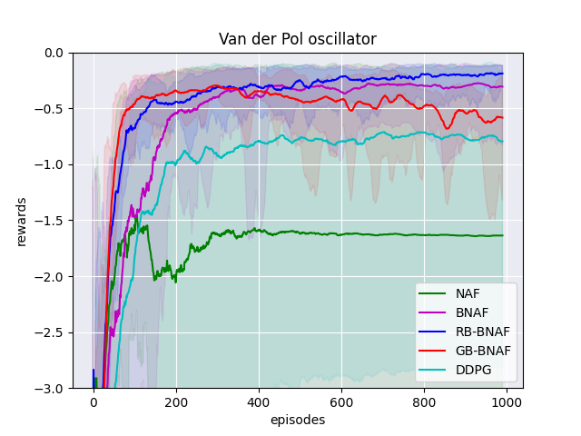
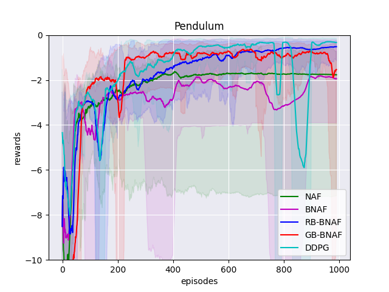
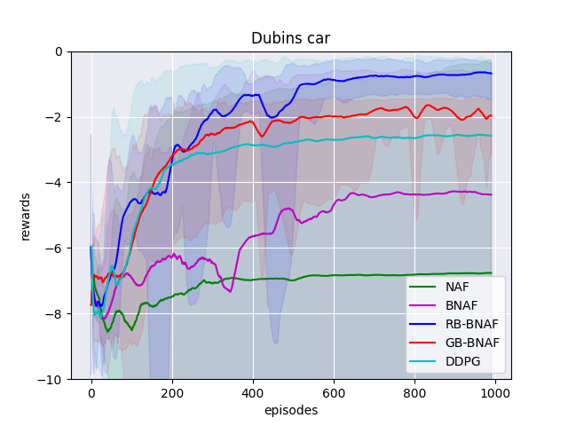
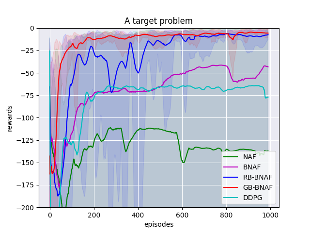

# Continuous Deep Q-Learning in Optimal Control Problems: Normalized Advantage Functions Analysis

The open-source implementation of the algorithms and the optimal control problems presented in the paper "Continuous Deep Q-Learning in Optimal Control Problems: Normalized Advantage Functions Analysis // Thirty-sixth Conference on Neural Information Processing Systems (NeurIPS 2022)"([download](https://github.com/imm-rl-lab/q-learning_with_bounded_naf/raw/main/paper_preprint.pdf))

Authors: Anton Plaksin, Stepan Martyanov

The following algorithms are implemented:

- Normalized Advantage Functions (NAF)
- Bounded Normalized Advantage Functions (BNAF)
- Reward-Based Bounded Normalized Advantage Functions (RB-NAF)
- Gradient-Based Bounded Normalized Advantage Functions (GB-NAF)
- Deep Deterministic Policy Gradient (DDPG)

The following optimal control problems are considered:    

- Van der Pol oscillator
- Pendulum
- Dubins Car
- Target Problem

 ## Requirements 
 
For training and evaluating described models, you will need python 3.6. To install requirements:    
    
```    
pip install -r requirements.txt    
```
    
## Training    
To train, run this command:    
    
```    
python train.py --config <path to config file>  
```

For example:
```    
python train.py --config .\configs\pendulum\naf.json
```
    
### **Training config file structure:** 

The training configuration file is presented as a json file with 3 required components - *environment*, *model*, *train_settings*.  
Each of these blocks has its own fields, presented in the tables below:  
  
#### environment's fields:  
  
| Parameter name| Type | example | Description |    
|-----------|------------|---------|-------------|    
| env_name|string| dubins-car| Optimal control problem to solve    
|dt| float  | 0.1        | Discretization step of continuous environment  

Possible *env_name* values:  
- *target-problem*
- *van-der-pol*  
- *pendulum*
- *dubins-car*  
  
#### model's fields:   

| Parameter name| Type | example | Description |    
|-----------|------------|---------|-------------|    
| model_name|string| naf| One of the algorithms, described in article    
|lr| float  | 0.001        | Learning rate  
|gamma| float  | 1        |Reward discount rate
|tau| float  | 0.01        | Smoothing parameter 

Possible *model_name* values:  
- *naf* - original Normalized Advanced Functions algorithm.  
- *bnaf* - bounded NAF.  
- *rb-bnaf* - reward-based bounded NAF.  
- *gb-bnaf* - gradient-based bounded NAF.
- *ddpg* - Deep Deterministic Policy Gradient.
  
#### train_settings fields:

| Parameter name| Type | example | Description |    
|-----------|------------|---------|-------------|    
|epoch_num|int| 1000|  Number of training epochs   
|batch_size| int| 128        | Batch size  
|gamma| float  | 1        |Reward discount rate  
|render| boolean  | false        | Is need to visualize the environment during training  
|random_seed| int| 0        | Random seed to fix stochastic effects  
|save_rewards_path| path| \path\to\file       |   Path to save training reward history in numpy array format  
|save_model_path| path| \path\to\file       |   Path to save trained agent  
|save_plot_path| path| \path\to\file       |   Path to save training reward history plot  
  
#### train_config.json example:

```
{
  "environment": {
    "env_name": "pendulum",
    "dt": 0.1
  },
  "model": {
    "model_name": "naf",
    "lr": 0.001,
    "gamma": 1,
	"tau":0.01
  },
  "learning": {
    "epoch_num": 1000,
    "batch_size": 128,
    "render": false,
    "random_seed": 0,
    "save_rewards_path": "./data/pendulum/naf_rewards",
    "save_model_path": "./data/pendulum/naf_model",
    "save_plot_path": "./data/pendulum/naf_plot"
  }
}
```    
 > You can find prepared config files for all environments in folder **/configs**.  
## Evaluation    
To evaluate pre-trained model, run:    
    
```  
python eval.py --config <path to config file>    
```
For example:

```  
python eval.py --config .\configs\eval_config.json
```  


This script prints to the console all the states of the environment during the evaluation and outputs the final score.    
  #### **Evaluation config file  structure:**   
  The configuration file is presented as a json file with 3 required params - *environment*, *checkpoint*, *random_seed*.  
    
  
    
| Parameter name | Type | example | Description |    
|-----------|------------|---------|-------------|    
| environment|json |{"env_name": "dubins-car",  "dt": 0.1 } | the same object as in the training section  
|model    |path |  \path\to\checkpoint\file               | Path to pre-trained model  
|random_seed|int|  0               | Random seed to fix stochastic effects  
    
> Note that you can only use the model for the task on which it was trained    

#### eval_config.json example:

```
{    
  "environment": {    
     "env_name": "dubins-car",      
     "dt": 0.1    
 },  
  "model": "./data/pendulum/naf_model",
  "random_seed": 0      
}   
```    
    
 ## Results
 We use the same learning parameters of every our tasks. We apply neural networks with two layers of 256 and 128 rectified linear units (ReLU) and learn their used ADAM with the learning rate **lr = 1e^{-3}**. We use batch size **n_{bs} = 128** and smoothing parameter **\tau = 1e^{-2}**. Also we take **\Delta t = 0.1**. All calculations were performed on a personal computer in a standard way.
    
**Plots:**    
 Figures below show the results of NAF, BNAF, RB-BNAF, GB-BNAF, DDPG algorithms averaged over 10 seeds. We use seed from 0 to 9. The curves are averaged for 20 episode for better visualization. 

|  |  |    
|:----:|:----:|    
| *Van der Pol oscillator* | *Pendulum* |    
|  |  |    
| *Dubins car* | *A target problem* |
    
#### Contributing 
If you'd like to contribute, or have any suggestions for these guidelines, you can open an issue on this GitHub repository.    
    
All contributions welcome!
